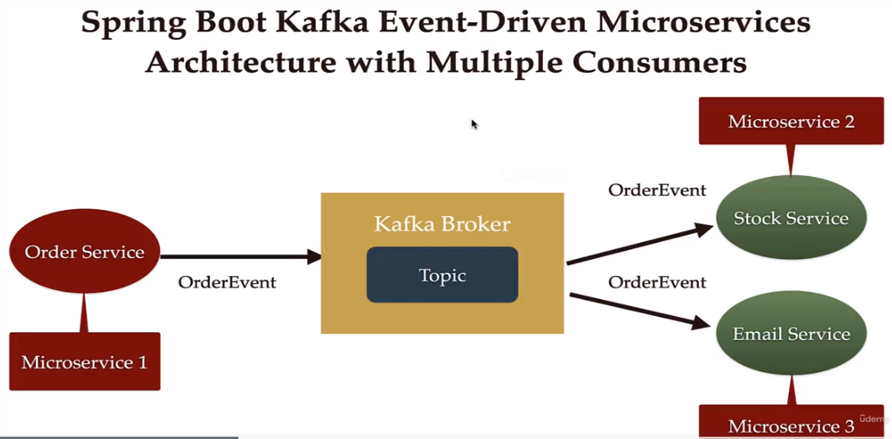

### udemy_spring_boot_cloud_microservices
 
# Building Microservices with Spring Boot &amp; Spring Cloud

## Section 2: Spring Boot REST API Development Basics
## Section 3: Building CRUD REST API’s with MySQL Database
## Section 4: Using DTO (Data Transfer Object) Pattern
## Section 5: Using Mapping Libraries to Map Entity to DTO and Vice Versa
## Section 6: Using Mapping Libraries to Map Entity to DTO and Vice Versa
## Section 6: Exception Handling in Spring Boot Application
## Section 7: Spring Boot REST API Validation
## Section 8: Spring Boot Actuator - Production Ready Features
## Section 9: Spring Boot REST API Documentation
## Section 10: Microservices Introduction
## Section 11: Building Microservices
## Section 13: Microservices Communication
### Microservices Communication using RestTemplate
### Microservices Communication using WebClient
### Microservices Communication using Spring Cloud OpenFeign
## Section 14: Service Registry and Discovery using Spring Cloud Netflix Eureka
### Spring Cloud Netflix Eureka Server Implementation
### Register DepartmentService Microservice as Eureka Client
### Register EmployeeService Microservice as Eureka Client
### Load Balancing with Eureka, Open Feign and Spring Cloud LoadBalancer
## Section 15: API Gateway using Spring Cloud Gateway
### Create and Set up API Gateway Microservice in IntelliJ IDEA
### Register API-Gateway as Eureka Client to Eureka Server
### Configuring API Gateway Routes and Test using Postman Client
### Using Spring Cloud Gateway to Automatically Create Routes
## Section 16: Centralized Configurations using Spring Cloud Config Server
### Create and Setup Spring Cloud Config Server Project in IntelliJ IDEA
### Register Config-Server as Eureka Client
### Set up Git Location for Config Server
### Refactor Department-Service to use Config Server 
### Refactor Employee-Service to use Config Server
### Refresh Use case - No Restart Required After Config Changes
## Section 17: Auto Refresh Config Changes using Spring Cloud Bus
docker pull rabbitmq
docker run -rm -it -p 5672:5672 rabbitmq
## Distributed Tracing with Spring Cloud Micrometer and Zipkin
run --rm -it --name zipkin -p 9411:9411 openzipkin/zipkin
## Section 19: Circuit Breaker using Resilience4J Implementation
### Circuit Breaker Pattern implementation using Resilience4j
### Retry Pattern Implementation using Resilience4j
## Section 21: Microservice organization
### MySql configuration
### JPA entity and repository
### Create OrganizationDto and OrganizationMapper
### Build Save Organization REST API
### Get Organization By Code REST API
### Communication REST API Call from Employee-Service to Organization-Service
### Register Organization-Service as Eureka Client
### Refactor Organization-Service to use Config Server
### Configure Spring Cloud Bus and Routes for Organization-Service in API-Gateway
### Implement distributed tracing in Organization-Service
## Section 22: Creating React Frontend Microservice
### Create React App using Create React App Tool
    npx create-react-app react-frontend
    cd react-frontend
    npm start
### Adding Bootstrap in React Using NPM
    npm install bootstrap --save
### Axios library Write HTTP Client Code to Connect React App with API-Gateway (REST API Call)
    npm install axios --save
### Create a React Component and Integrate with API Gateway Microservice
### Design the Page to Display User, Department and Organization Details
## Section 24: Department-Service - REST API Documentation
## Section 25: Organization-Service - REST API Documentation
## Section 26: Employee-Service - REST API Documentation
## Section 27: Dockering Spring Boot Application Step by Step
### Create Spring Boot Project and Build Simple REST API
### Create Dockerfile to Build Docker Image 
### Run Docker Image in a Docker Container
---
    docker build -t springboot-docker-demo .
    docker run -p8080:8080 springboot-docker-demo

-- detach mode

    docker run -p8080:8080 -d springboot-docker-demo

-- view logs

    docker logs -f 3cfc

## Push Docker Image to DockerHub

    docker tag springboot-docker-demo javaguides/springboot-docker-demo:0.1.RELEASE
    docker push javaguides/springboot-docker-demo:0.1.RELEASE

## Section 28: Dockering Spring Boot MySQL CRUD Application Step by Step
### Pull and Run MySQL Image in a Docker Container

-- pull mysql images  

    docker pull mysql

    
-- create network

    docker network create springboot-mysql-net

-- run mysql docker container

    docker run --name mysqldb --network springboot-mysql-net -e MYSQL_ROOT_PASSWORD=root -e MYSQL_DATABASE=employee_db -d mysql

-- enter to container

    docker exec -it mysqldb bash

### Implement Profile and Build Docker image
### Run Spring Boot App Docker Image in a Container and Test CRUD REST APIs

-- create image springboot-restful-webservices and run

    cd /springboot-restful-webservices
    docker build -t springboot-restful-webservices .
    docker run --network springboot-mysql-net --name springboot-mysql-container -p 8080:8080 springboot-restful-webservices

## Section 29: Docker Compose - Dockering Spring Boot MySQL CRUD Application Step by Step
### Configure and Run MySQL Image in a Container using Docker Compose
### Configure and Run Spring Boot in a Container using Docker Compose

    docker compose up
    docker compose up -d
    docker logs -f mysqldb
    docker compose down
    docker compose up -d --build

## Section 30: Learn Apache Kafka with Spring Boot
### Install and Set up Kafka

    Kafka with ZooKeeper
    Run the following commands in order to start all services in the correct order:

    Start the ZooKeeper service
    $ bin/zookeeper-server-start.sh config/zookeeper.properties
    
    Open another terminal session and run:

    Start the Kafka broker service
    $ bin/kafka-server-start.sh config/server.properties

### Create and Setup Spring Boot Project
### Configure Kafka Producer and Consumer
### Create Kafka Topic
### Create Kafka Producer
### Create REST API to Send Message
### Create Kafka Consumer
### Configure Kafka Producer and Consumer for JSON Serializer and Deserializer
### Create Simple POJO to Serialize/Deserialize
### Create Kafka Producer to Produce JSON Message
### Create REST API to Send JSON Object
### Create Kafka Consumer to Consume JSON Message
### Refactor Code to Externalize The Topic Name - Remove Hard Coded Values

## Section 31: Spring Boot Kafka Real-World Project - Wikimedia Data Processing
### Spring Boot Kafka Project Setup - Create Two Microservices
### Wikimedia Producer Spring Boot Project Setup
### Configure Wikimedia Producer and Create a Topic
### Wikimedia Producer Implementation
### Kafka Consumer Project Setup
### Configure Kafka Consumer in application.properties File
### Kafka Consumer Implementation
### Configure MySQL Database
### Save Wikimedia Data into MySQL Database
### Refactor Code to Externalize The Topic Name - Remove HardCoded Values

    Check messages in topic
    $ bin/kafka-console-consumer.sh --topic wikimedia_recentchange --from-beginning --bootstrap-server localhost:9092

## Section 32: Event-Driven Microservices using Spring boot and Kafka
### Create 4 Microservices - OrderService, StockService, EmailService & Base-Domains

### Base-Domains Microservice - Create DTO Classes - Order and OrderEvent
### OrderService Microservice - Configure Kafka Producer - Kafka topic - REST API send order
### StockService Microservice - Configure and Create Kafka Consumer
### EmailService Microservice - Configure and Create Kafka Consumer